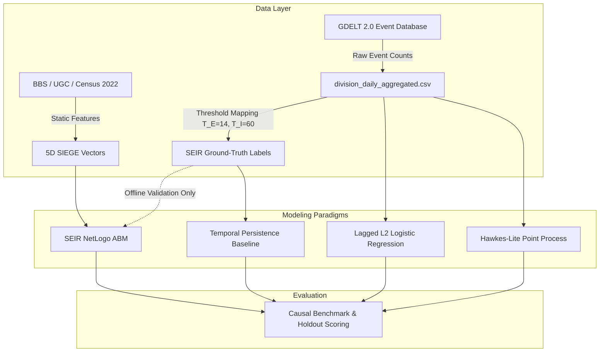

# Diagram

```mermaid
flowchart TD
    subgraph Data Layer
        G[GDELT 2.0 Event Database] -->|Raw Event Counts| AGG[division_daily_aggregated.csv]
        AGG -->|Threshold Mapping T_E=14, T_I=60| GT[SEIR Ground-Truth Labels]
        BBS[BBS / UGC / Census 2022] -->|Static Features| SIEGE[5D SIEGE Vectors]
    end

    subgraph Modeling Paradigms
        SIEGE --> ABM[SEIR NetLogo ABM]
        GT -.->|Offline Validation Only| ABM
        GT --> PERS[Temporal Persistence Baseline]
        AGG --> LOG[Lagged L2 Logistic Regression]
        AGG --> HWK[Hawkes-Lite Point Process]
    end

    subgraph Evaluation
        ABM --> EVAL[Causal Benchmark & Holdout Scoring]
        PERS --> EVAL
        LOG --> EVAL
        HWK --> EVAL
    end
```

After the diagram.
